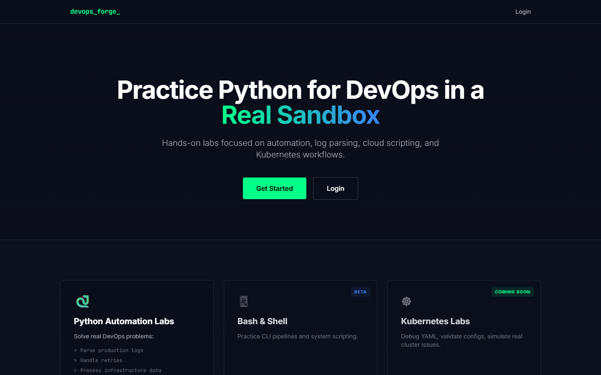
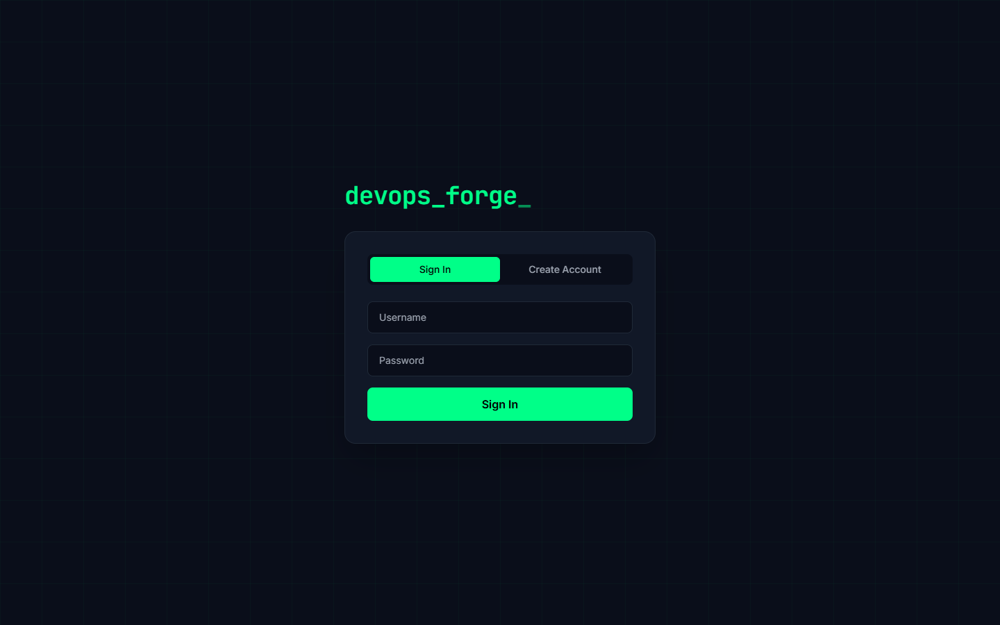

<div align="center">
  <h1>⚙️🐍 DevOps Python Forge</h1>
  <p>A production-grade, exercise-driven Python learning platform for DevOps engineers.</p>
  
  [](https://www.python.org/downloads/)
  [](https://nextjs.org/)
  [](https://fastapi.tiangolo.com/)
  [](https://ollama.ai/)
  [](https://opensource.org/licenses/MIT)
</div>

<br />

Master Python from "Hello World" to building advanced DevOps CLI tools and asynchronous scripts through **193 hands-on, sandboxed exercises** spanning 11 progressive levels.

---

## ✨ Platform Features

<details open>
<summary><b>🐳 Instant Docker Execution Sandbox</b></summary>
<br />
No more fake emulators. Every time you run or submit code, it executes instantly inside a secure, resource-limited Python 3.11 Docker container. This guarantees 100% accurate standard library behavior, allowing you to safely test file I/O, subprocesses, and OS-level operations without risks to the host.
<br />
</details>

<details open>
<summary><b>💻 Interactive WebSocket Terminal</b></summary>
<br />
Experience a true REPL environment. The in-browser terminal connects to the background Docker container via lightning-fast WebSockets, allowing you to type inputs in real-time, handle asynchronous streams, and debug interactively.
<br />
</details>

<details>
<summary><b>🤖 Local AI Code Mentor (Ollama)</b></summary>
<br />
Get contextual help when you're stuck, or request a senior code review. Uses a completely private, local <strong>Qwen 2.5 Coder 1.5b</strong> model—your code never leaves the sandbox!
<br /><br />
<div align="center">
  
</div>
</details>

<details>
<summary><b>🖥️ Next-Gen Browser IDE</b></summary>
<br />
Write code in a fully featured <b>Monaco Editor</b> (the engine behind VS Code) embedded directly in the browser, featuring syntax highlighting, auto-formatting, and custom shortcuts.
<br /><br />
<div align="center">
  
</div>
</details>

<details>
<summary><b>🔐 Secure Authentication & Gamification</b></summary>
<br />
Dedicated JWT authentication with a secure registration flow. Track your progress, earn XP, unlock hints, and compete on the global leaderboard.
<br /><br />
<div align="center">
  
</div>
</details>

### Platform Capabilities
- 🎯 **193 Progressive Exercises**: Spanning 11 levels (Basics to Capstone DevOps Projects).
- 🔒 **Docker-Driven Sandbox**: Real Linux containers, real time execution. No mocked AST limits.
- 💡 **Progressive Unlocks**: Hints and conceptual breakdowns automatically unlock after failed attempts to prevent spoilers.
- 📊 **Progress Dashboard**: Per-level breakdowns, activity heatmaps, and platform statistics.
- 🛡️ **Admin Panel**: Complete CRUD access over exercises, users, and hints.

---

## 🏗️ Technology Stack

| Ecosystem | Technology | Description |
|-----------|------------|-------------|
| **Frontend** | Next.js 14, React, Tailwind CSS | High-performance React framework with utility-first styling. |
| **Backend** | Python 3.11+, FastAPI, WebSockets | Asynchronous API server with real-time bidirectional streaming. |
| **Database** | SQLite + SQLAlchemy | Lightweight relational database with powerful ORM. |
| **Execution** | Docker Daemon Integration | Ephemeral, resource-constrained containerized execution. |
| **AI Subsystem** | Ollama | Local LLM inference engine running `qwen2.5-coder:1.5b`. |

---

## 🚀 Quick Start

### Option A: Docker (Recommended)
Launch the entire platform (Frontend, Backend, Database, and Ollama AI) automatically.
```bash
docker-compose up --build
```

### Option B: Local Setup

#### 1. Backend API
```bash
cd backend
python -m venv venv

# Windows
.\venv\Scripts\activate
# Mac/Linux
# source venv/bin/activate

pip install -r requirements.txt

# Seed the database with all 193 exercises
python seed/seed_db.py

# Start the server
uvicorn main:app --reload --port 8000
```

#### 2. Frontend App
```bash
cd frontend
npm install
npm run dev
```
Navigate to **http://localhost:3000**.

*(Note: To use the AI Mentor locally without Docker, you must install [Ollama](https://ollama.com/) on your host machine and run `ollama pull qwen2.5-coder:1.5b` and ensure the Ollama API is running on localhost:11434).*

---

## 📚 Exercise Modules

| Level | Module Topic | Count | Focus |
|-------|--------------|-------|-------|
| **0** | **Execution Basics** | 10 | Printing, variable assignment, basic math |
| **1** | **Core Fundamentals** | 20 | Types, strings, input/output |
| **2** | **Control Flow Mastery** | 20 | If/else, loops, conditionals |
| **3** | **Data Structures** | 25 | Lists, dictionaries, sets, tuples |
| **4** | **Functions & Modularity** | 20 | Arguments, scope, recursion |
| **5** | **File Handling & I/O** | 25 | Reading/writing logs, CSVs, JSON |
| **6** | **Error Handling** | 15 | Exceptions, try/except blocks |
| **7** | **API & Networking** | 20 | Requests, JSON parsing, REST |
| **8** | **CLI Tools** | 20 | Argparse, sys.argv, subprocess |
| **9** | **Concurrency & Async** | 15 | Asyncio, threading, multiprocess |
| **10**| **DevOps Capstones** | 5 | Log analyzers, deployment scripts |

---

---

## 🛡️ Sandbox Security Architecture
The platform utilizes a state-of-the-art containerized security model, moving beyond basic AST parsing to provide true OS-level isolation:
- **Ephemeral Docker Containers**: Every code execution spins up a fresh, zero-state `python:3.11-slim` container using the `--rm` flag, ensuring no malware can persist.
- **Strict Resource Quotas**: Containers are rigidly constrained with `--cpus="0.5"` and `--memory="128m"` to prevent Fork Bombs and Cryptojacking.
- **Total Network Isolation**: Containers run with `--network=none`, completely disabling internet access and preventing data exfiltration or botnet recruitment.
- **Read-Only Mounting**: User scripts are mounted as read-only volumes, preventing modifications to the host execution environment.
- **Interactive Timeouts**: Background WebSocket sessions are capped at 5 minutes, while automated test grading is forcefully killed after 3 seconds.

---

<div align="center">
  📝 <strong>DevOps Python Forge</strong> is licensed under the <strong>MIT License</strong>.
</div>
